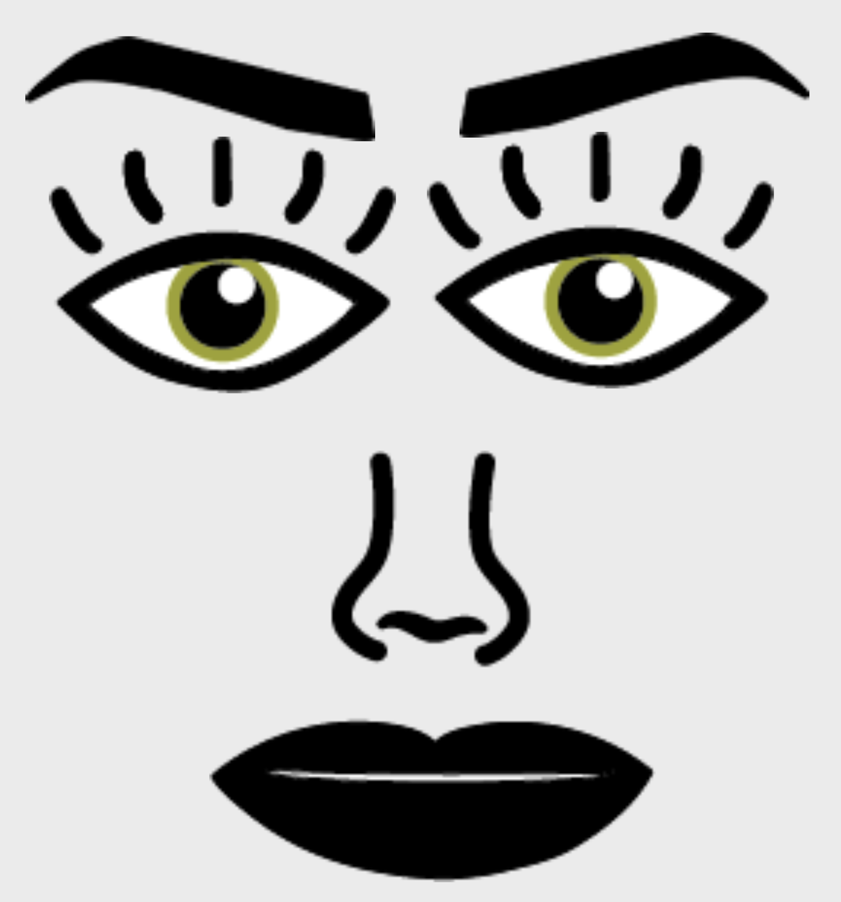
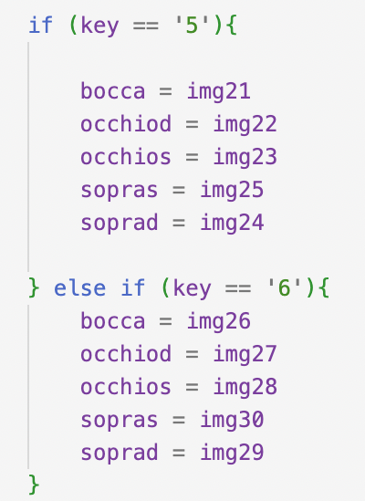

SUPSI 2022-23  
Corso d’interaction design, CV427.01  
Docenti: A. Gysin, G. Profeta  

Elaborato 1: Marionetta digitale  

# Marionetta espressiva
Autore: Chiara Andreoli 
[Marionetta](https://andreolichiara.github.io/marionetta_gigi/)

## Introduzione e tema
Il compito assegnato era quello di realizzare
una marionetta digitale, ovvero creare un sistema
d’interfaccia che permetta di generare una marionetta applicabile sulla mano attraverso la realtà
aumentata e l’utilizzo della webcam del computer.
Il soggetto deve rappresentare un determinato
personaggio, il quale deve comunicare il proprio
carattere e le proprie espressioni.

## Design dell’interfraccia e modalià di interazione
La marionetta che ho realizzato è composta da un
volto, con le sopracciglia gli occhi e la bocca.
Ogni elemento è posizionato in diversi punti della mano, il sopracciglio destro è posizionato sul
punto 12, il sinistro sull’8, l’occhio destro sul
punto 11, l’occhio sinistro sul 7, infine la bocca è posizionata sul punto 4. La mano deve essere
rivolta con il palmo verso la webcam facendo con
le dita il numero 2.
La marionetta si presenta con un’espressione felice, e per farla cambiare si deve digitare la
sequenza di numeri, dall’1 all’8. Ogni numero
corrisponde a un’espressione differente, così da
passare da felice ad arrabbiata.
 

## Tecnologia usata
Per inserire i vari elementi nella posizione corretta, ho dovuto utilizzare una funzione specifica
nella sezione “async function draw”
 

 
 
Successivamente ho dovuto inserire la funzione
“function keyPressed” utilizzando “if” e “else
if” per la sequenza numerica, in modo tale da poter cambiare l’espressione della marionetta.
 

## Target e contesto d’uso
Il mio target di riferimento è rappresentato da
ragazzi e adulti, interessati all’ambito dell’interaction design, della grafica e dell’illustrazione. La marionetta si potrebbe utilizzare e
mostrare nelle classi e nelle scuole.

