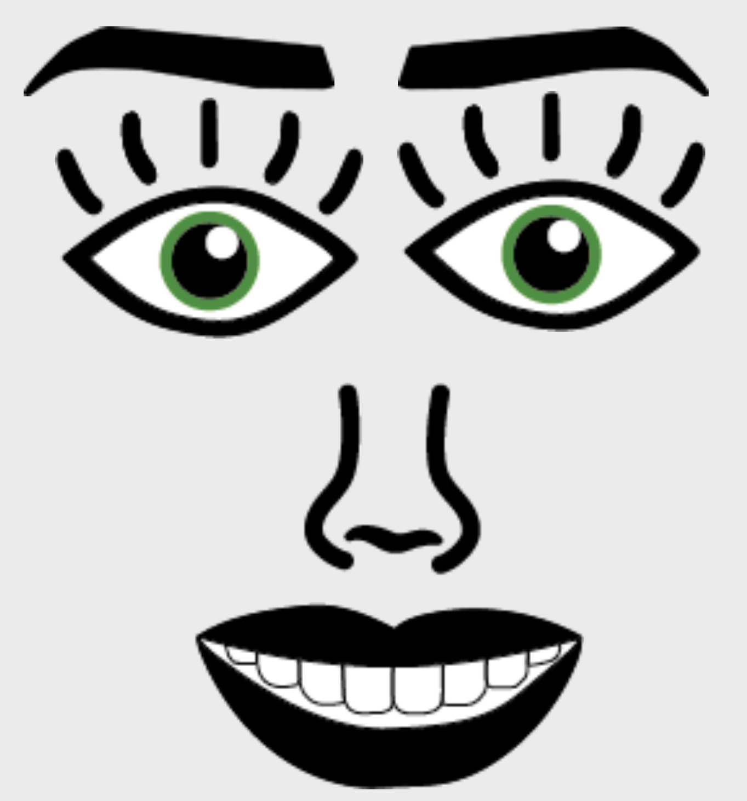
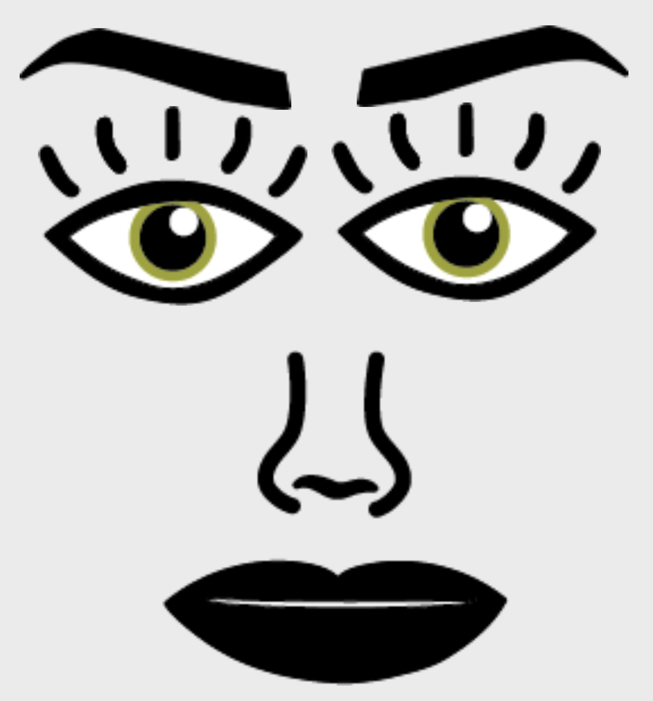
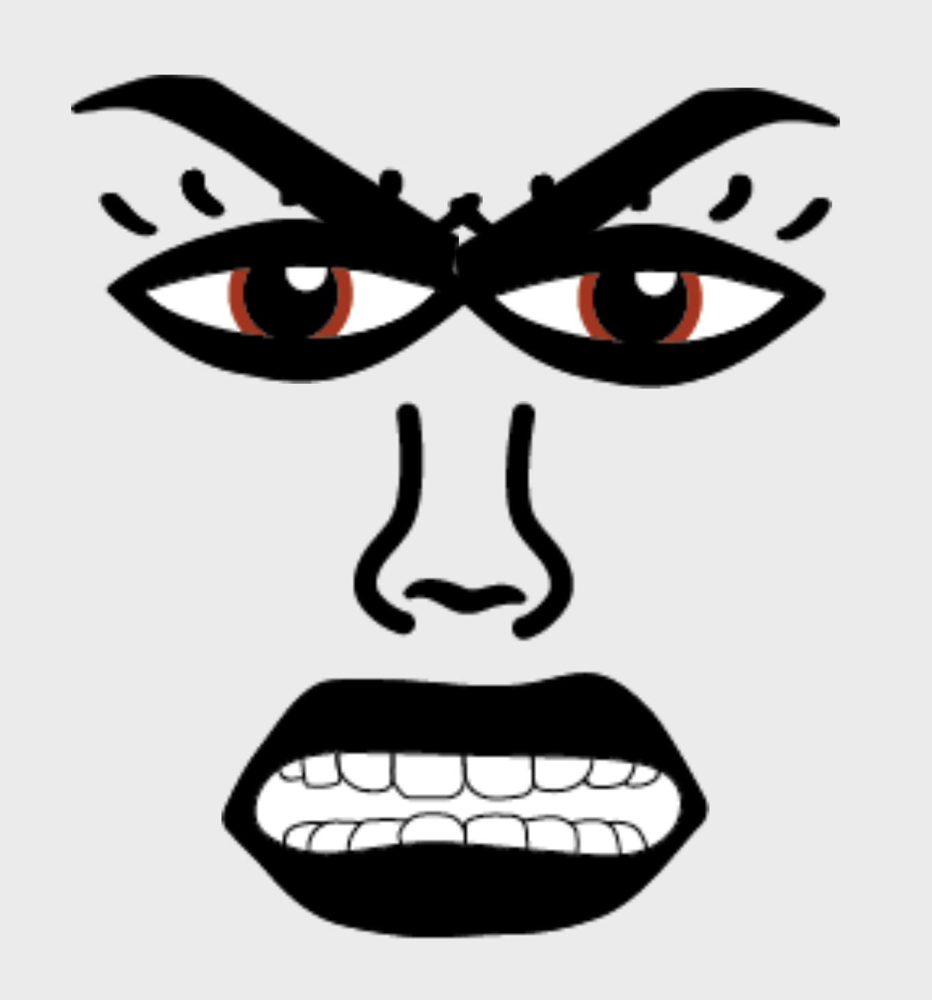

SUPSI 2022-23  
Corso d’interaction design, CV427.01  
Docenti: A. Gysin, G. Profeta  

Elaborato 1: Marionetta digitale  

# Marionetta espressiva
Autore: Chiara Andreoli  
[Marionetta emotiva](https://andreolichiara.github.io/marionetta_gigi_emotiva/)

## Introduzione e tema
Il compito assegnato era quello di realizzare
una marionetta digitale, ovvero creare un sistema
d’interfaccia che permetta di generare una marionetta applicabile sulla mano attraverso la realtà
aumentata e l’utilizzo della webcam del computer.
Il soggetto deve rappresentare un determinato
personaggio, il quale deve comunicare il proprio
carattere e le proprie espressioni.

## Design dell’interfraccia e modalià di interazione
La marionetta che ho realizzato è composta da un
volto, con le sopracciglia gli occhi e la bocca.
Ogni elemento è posizionato in diversi punti della mano, il sopracciglio destro è posizionato sul
punto 12, il sinistro sull’8, l’occhio destro sul
punto 11, l’occhio sinistro sul 7, infine la bocca è posizionata sul punto 4. La mano deve essere
rivolta con il palmo verso la webcam facendo con
le dita il numero 2.
La marionetta si presenta con un’espressione felice, e per farla cambiare si deve digitare la
sequenza di numeri, dall’1 all’8. Ogni numero
corrisponde a un’espressione differente, così da
passare da felice ad arrabbiata.  
 

## Tecnologia usata
Per inserire i vari elementi nella posizione corretta, ho dovuto utilizzare una funzione specifica
nella sezione “async function draw” 
 
 
Successivamente ho dovuto inserire la funzione
“function keyPressed” utilizzando “if” e “else
if” per la sequenza numerica, in modo tale da poter cambiare l’espressione della marionetta.  
 

        
    if (detector && capture.loadedmetadata) {
	const hands = await detector.estimateHands(capture.elt, { flipHorizontal: true })

	for (let j=0; j<hands.length; j++) {
		const hand = hands[j]
		const handedness = hand.handedness // Left : Right
		noStroke()
		fill(0) 
	
		image (sopras, hand.keypoints[8].x, hand.keypoints[8].y)
		image(soprad, hand.keypoints[12].x, hand.keypoints[12].y);
		image (occhiod, hand.keypoints[7].x, hand.keypoints[7].y);			
		image (occhios, hand.keypoints[11].x, hand.keypoints[11].y);				
		image (bocca, hand.keypoints[4].x, hand.keypoints[4].y);
			}		
		}		

 

    
    
    function keyPressed () {
	
	if (key == '1'){	
		
		bocca = img
		occhiod = img2
		occhios = img3
		sopras = img5
		soprad = img4
		
	} else if (key == '2'){
		bocca = img6
		occhiod = img7
		occhios = img8
		sopras = img10
		soprad = img9
	}

	if (key == '3'){	
		
		bocca = img11
		occhiod = img12
		occhios = img13
		sopras = img15
		soprad = img14
		
	} else if (key == '4'){
		bocca = img16
		occhiod = img17
		occhios = img18
		sopras = img19
		soprad = img20
	}

	if (key == '5'){	
		
		bocca = img21
		occhiod = img22
		occhios = img23
		sopras = img25
		soprad = img24
		
	} else if (key == '6'){
		bocca = img26
		occhiod = img27
		occhios = img28
		sopras = img30
		soprad = img29
	}

	if (key == '7'){	
		
		bocca = img31
		occhiod = img32
		occhios = img33
		sopras = img35
		soprad = img34
		
	} else if (key == '8'){
		bocca = img36
		occhiod = img37
		occhios = img38
		sopras = img40
		soprad = img39
        }
	}

## Target e contesto d’uso
Il mio target di riferimento è rappresentato da
ragazzi e adulti, interessati all’ambito dell’interaction design, della grafica e dell’illustrazione. La marionetta si potrebbe utilizzare e
mostrare nelle classi e nelle scuole.

